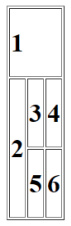

# P11_WebFundamentals
## Web Fundamentals assignment
###### Week1 > Session2 > Assignments > Intermediate
###
### 1. Create a table with 3 rows and 3 columns. The top row contains 1 cell that spans 3 columns. The leftmost cell on the next row spans 2 rows. All other cells span a single row and column.
Each cell has a number. The numbers can be put in an `<h1>` tag if desired. The image below shows what the table should look like using `<h1>` tags around the numbers.

Solution:
```html
<!DOCTYPE html>
<html lang="en">
<head>
    <meta charset="UTF-8">
    <meta http-equiv="X-UA-Compatible" content="IE=edge">
    <meta name="viewport" content="width=device-width, initial-scale=1.0">
    <title>HTML Tables</title>
</head>
<body>
    <table border="1">
        <tr>
            <td rowspan="2" colspan="3">
                <h1>1</h1>
            </td>
        </tr>
        <tr></tr>   <!-- If we remove this table structure will become wrong. Want to know how to fix it -->
        <tr>
            <td rowspan="2">
                <h1>2</h1>
            </td>
                <td><h1>3</h1></td>
                <td><h1>4</h1></td>
            <tr>
                <td><h1>5</h1></td>
                <td><h1>6</h1></td>
            </tr>

        </tr>
</table>
</body>
</html>
```
Output:
<!DOCTYPE html>
<html lang="en">
<head>
    <meta charset="UTF-8">
    <meta http-equiv="X-UA-Compatible" content="IE=edge">
    <meta name="viewport" content="width=device-width, initial-scale=1.0">
    <title>HTML Tables</title>
</head>
<body>
    <table border="1">
        <tr>
            <td rowspan="2" colspan="3">
                <h1>1</h1>
            </td>
        </tr>
        <tr></tr>   <!-- If we remove this table structure will become wrong. Want to know how to fix it -->
        <tr>
            <td rowspan="2">
                <h1>2</h1>
            </td>
                <td><h1>3</h1></td>
                <td><h1>4</h1></td>
            <tr>
                <td><h1>5</h1></td>
                <td><h1>6</h1></td>
            </tr>
        </tr>
</table>
</body>
</html>

### 2. Recreate the list shown in the image below: The outer list is an order list, and the nested lists are unordered
1. Desktop
    - Linux
    - Mac OS
    - Windows
2. Mobile
    - Android
    - iOS

Solution:
```html
<!DOCTYPE html>
<html lang="en">
<head>
    <meta charset="UTF-8">
    <meta http-equiv="X-UA-Compatible" content="IE=edge">
    <meta name="viewport" content="width=device-width, initial-scale=1.0">
    <title>HTML Lists</title>
</head>
<body>
    <ol>
        <li>Desktop</li>
        <ul>
            <li>Linux</li>
            <li>Mac OS</li>
            <li>Windows</li>
        </ul>
        <li>Mobile</li>
        <ul>
            <li>Android</li>
            <li>iOS</li>
        </ul>
    </ol>
</body>
</html>
```
Output:
<!DOCTYPE html>
<html lang="en">
<head>
    <meta charset="UTF-8">
    <meta http-equiv="X-UA-Compatible" content="IE=edge">
    <meta name="viewport" content="width=device-width, initial-scale=1.0">
    <title>HTML Lists</title>
</head>
<body>
    <ol>
        <li>Desktop</li>
        <ul>
            <li>Linux</li>
            <li>Mac OS</li>
            <li>Windows</li>
        </ul>
        <li>Mobile</li>
        <ul>
            <li>Android</li>
            <li>iOS</li>
        </ul>
    </ol>
</body>
</html>